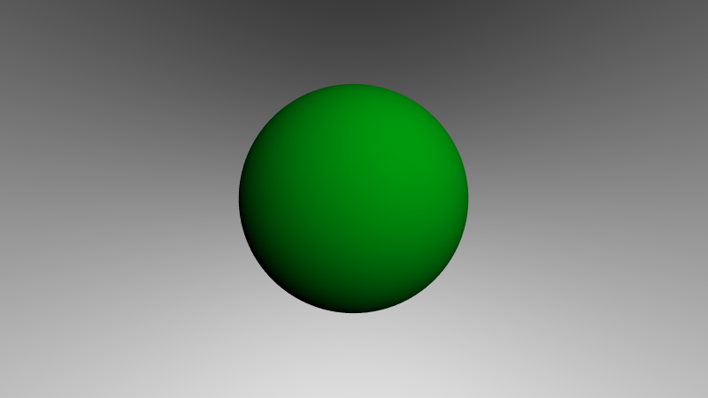

# Ray Tracing - Projeto 3
Matheus Girardin e Rodrigo Soares

## Primeira Esfera

Esfera lambertiana

## Segunda Esfera

Mudando fonte de luz e cor da esfera, adicinando reflexão de Phong

## Terceira Esfera

Mudando novamente fonte de luz e a cor

